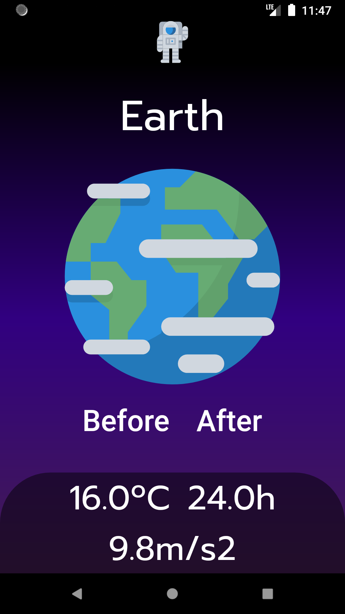

# Planets Wiki

</img>

This is a simple Flutter App developed by me in 2 hours, first flutter project it is supposed to show the most important data of the planets in our solar system, with the average temperature, time for one revolution(1 day) and the gravity acceleration in meters per second squared

## Assets

To get the assets just follow the link bellow, they are great and perfect for mobile projects like this
https://www.flaticon.com/packs/space-85?word=planets
